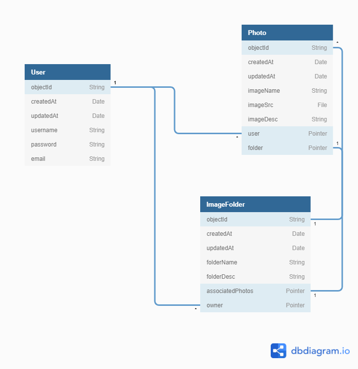
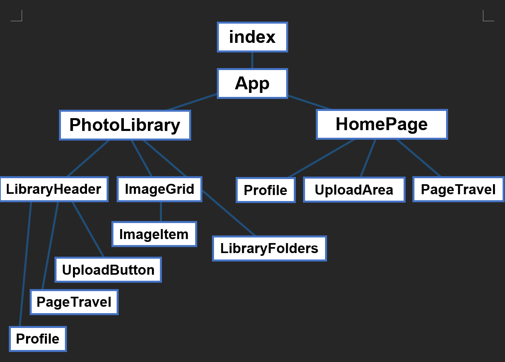

# Web Dev Image Hosting
An app to upload any image you want and get a shareable link to send to your
friends. Will work similarly to Imgur.

| Student A       | Student B       |
|-----------------|-----------------|
| Simon Rodriguez | Gerry Fernandez |
| srodrig9@nd.edu | gfernan2@nd.edu |

# Running the Dev Server

Simply run `npm start`. If you are missing dependencies, make sure you run
`npm i` as well.

# Feature 6 Notes

## Late Submission
We apologize for submitting late! We spoke with Professor Wicks, who gave us an
extension until Friday night.

## Submission Note
We pair-programmed most of the way, so by nature our code was already coupled
together, and in many cases, some of one person's additions affected the other,
we are sorry if this causes issues grading!

## User Stories Changes
We ran into issues implementing our Auth0 user story related to Back4App
limitations. We had heard it was possible to implement custom authentication
through Parse Server but we did not realize Back4App only supported specific
OAuth websites and not an all-in-one solution such as Auth0. Because of this,
we made some changes to our user stories to make up for the lost work from being
unable to use Auth0. Changed user stories are bolded.

### Student A User Stories (Simon)
1. As a user, I would like better mobile layout support in the application to better use the program on my phone.

2. As a user, I would like the website to be set up on a deployment service such as Netlify or Heroku to easily access the website from anywhere

3. As a user, I would like animations on the elements of the webpage for a more responsive and elegant web experience.
### Student B User Stories (Gerry)
1. As a user, I would like a User Profile page in order to manage my user details, as well as change my profile picture, name, or email.

2. **~~As a developer, I would like authentication to be handled by an external service such as Auth0 for additional security plus other OAuth services.~~**

3. **As a user, I would like additional details and actions to appear when
clicking on an image in my library (new)**

4. **As a user, I would like an alert system when certain actions such as 
uploading an image to inform me about the app's state. (new)**

## Animations
I initially wanted to do all of the animations using a library called
`framer-motion`, but I quickly found out some animations do not seem to work
inside of a router. Instead, I settled on a compromise of animations 
done in CSS and others done in framer motion.

## Hosting
The website is hosted at https://images.rodrig.dev/. Feel free to use that
instance as well for testing!

## Login
We tested with the same accounts as before. They are listed in the table below:

| Username/Email  | Password        | Notes                                     |
|-----------------|-----------------|-------------------------------------------|
| srodrig9        | 1234            | Contains multiple images and even folders.|
| gfernan2        | 1234            | Contains a smaller amount of images       |
| mwicks@nd.edu   | 1234            | No images                                 |
| pbui@nd.edu     | 1234            | Also no images                            |

------------------

# Feature 5 Notes
User log-in and registration should work, so feel free to create a new User and test things out.
We have dummy User accounts set up with respective Photo Libraries and images, so feel free to look at those as well.

Example Accounts:
- User: gfernan2 Pass: 1234
- User: srodrig9 Pass: 1234
- User: mwicks@nd.edu Pass: 1234
- User: pbui@nd.edu Pass: 1234

# Feature 4 Notes
Because we haven't implemented user switching yet, we cycle by default between
two user, Simon and Gerry. Note that you can change users by clicking on the 
user profile at the top right of the page. You'll see that Gerry has pictures of
sea turtles and no folders, while Simon has a folder called "Beavers" with the
corresponding pictures. To navigate between our two pages, click on the chevron
button at the top and bottom of this page. 

Note that in the Photo Library, you can click on "Your Library" to switch go 
back out of a folder into the original view.

You can click on an image to copy it to your clipboard.

# Diagrams

## UML Diagram

## Component Tree

# Environment Variables
To run the program, you need to make sure you set the correct environment
variables. The easiest way to do this is to create a `.env` file. We've
provided a `.template.env` to give you an idea on what needs to be set. Simply
replace the `<YOUR_VALUE_HERE>` sections with the correct API keys. For
submission, we've already included a preconfigured .env file.